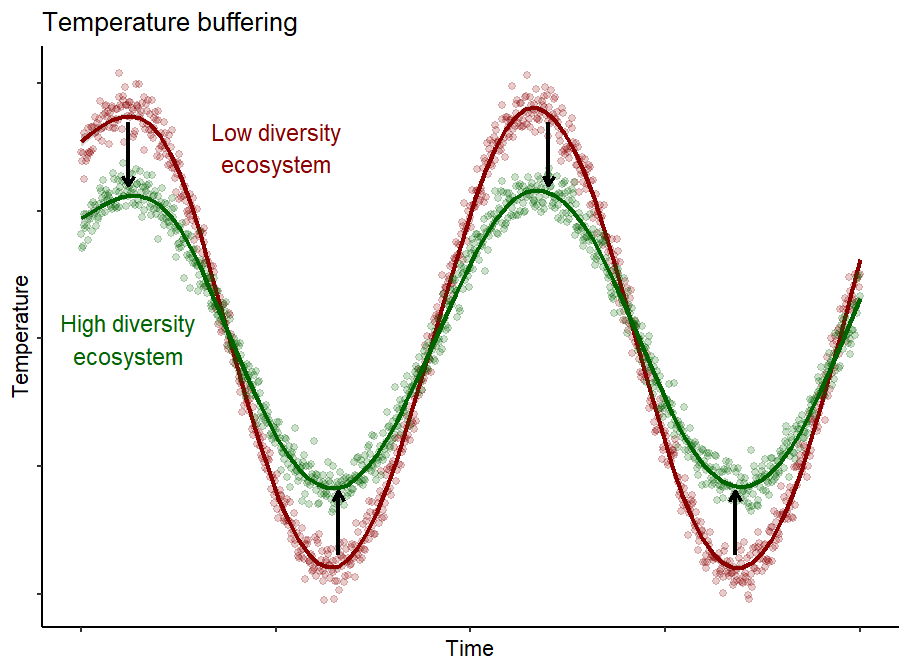
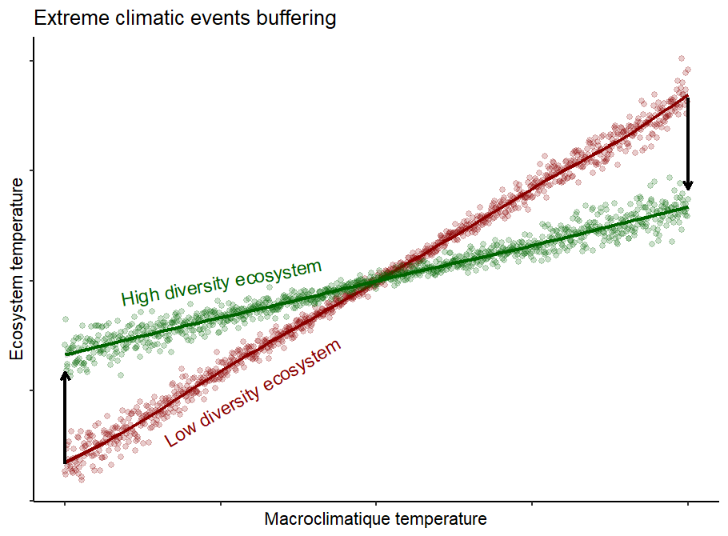

The SoilDivTemp project aims to quantify and understand diversity buffering of soil temperature fluctuation. This project is base on the international [SoilTemp](https://twitter.com/SoilTemp_proj) consortium compiling soil temperature measurements from around the world, biomes and ecosystems.

Our main hypothesis is that plant diversity can buffer temperature fluctuations (Fig. 1) and extreme climatic event (Fig. 2), and therefore, reduce the effects of climate change on ecosystems. We are testing this hypothesis using both experiments where diversity is manipulated; such as [BEF China](https://bef-china.com/) and [The Jena Experiment](http://the-jena-experiment.de/); and natural field measurements with the SoilTemp consorsium datasets.

Figure 1: climate buffering by plant diversity

Figure 2: climatic extreme buffering by plant diversity

